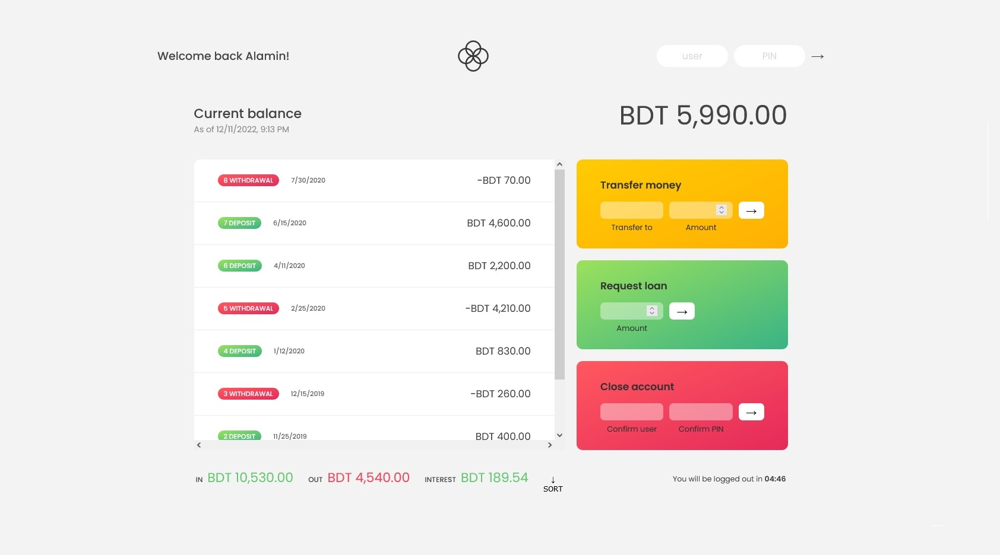

# Bankinst-app
This is a simple bankist app I just made after learning some JavaScript from Jonas Schmedtmann's course.

- [👉Live Preview👈](https://bankist-codepapa360.netlify.app/)

### Built with

- Semantic HTML5 markup
- CSS custom properties
- Javascript
- Flexbox
- Grid

## Test Username and PIN
Username: js 
PIN: 1111 

username: am 
PIN: 2222 

username: jd 
PIN: 3333 

## My Social Media

- LinkedIn - [@CodePapa360](https://www.linkedin.com/in/codepapa360)
- Twitter - [@CodePapa360](https://www.twitter.com/CodePapa360)
- Frontend Mentor - [@CodePapa360](https://www.frontendmentor.io/profile/CodePapa360)

#### Screenshot

#### Flowchart

